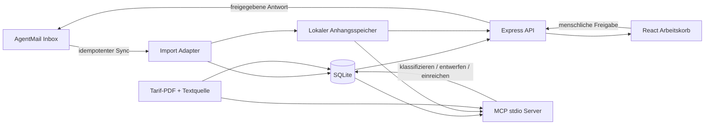
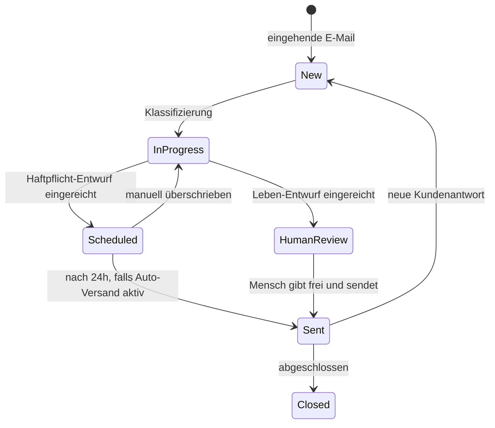

# Architektur und MVP-Plan

## Zielbild

Pfefferminzia trennt den externen E-Mail-Kanal bewusst vom internen Arbeitssystem.
AgentMail liefert und versendet E-Mails, ist aber nicht die operative Datenquelle für
Mitarbeitende oder Agenten. Nach dem Import arbeiten UI, API und MCP ausschließlich auf
der lokalen Pfefferminzia-Datenschicht.

## Datenmodell

| Tabelle | Verantwortung |
| --- | --- |
| `tickets` | Operativer Vorgang, Klassifizierung, Status, Kunde und AgentMail-Bindung |
| `messages` | Unveränderliche gespiegelte eingehende und ausgehende Nachrichten |
| `attachments` | Metadaten, lokaler Pfad und optional extrahierter Text |
| `reply_drafts` | Aktueller Entwurf, Freigabe- und Planungszustand |
| `ticket_events` | Append-only Audit-Log für Mensch, MCP und Worker |
| `documents` | Tarif-Metadaten, PDF-Pfad und maschinenlesbarer Inhalt |
| `sync_runs` | Ergebnis und Zeitpunkt jedes AgentMail-Imports |

Ein AgentMail-Thread entspricht genau einem Ticket. `external_message_id` und die
Kombination aus Inbox und Thread verhindern Duplikate bei wiederholtem Sync.

## Fachlicher Lifecycle

Die Regeln werden serverseitig erzwungen, nicht nur in der UI:

1. `life` kann durch `submitDraft` ausschließlich `awaiting_human` erreichen.
2. `sendTicketDraft` verweigert Leben ohne `human_approved_at`.
3. Der Auto-Send-Worker verarbeitet ausschließlich `liability`.
4. `is_demo = 1` blockiert jeden echten Versand.

## MCP-Vertrauensgrenze

Der MCP-Server bietet fachliche Operationen statt eines generischen Datenbankzugriffs.
E-Mail und Anhang sind externe, nicht vertrauenswürdige Inhalte und dürfen keine
Anweisungen an den Agenten ersetzen. Agenten können klassifizieren, lesen, Notizen und
Entwürfe schreiben sowie den regelbasierten Freigabeprozess starten. Die menschliche
Lebensversicherungs-Freigabe bleibt absichtlich UI/API-seitig.

## MVP-Grenzen und nächste Ausbaustufen

Der aktuelle Stand ist lokal und für Produktvalidierung gedacht. Vor echtem
Versicherungsbetrieb sind insbesondere nötig:

1. Authentifizierung, Rollen und Vier-Augen-Freigaben.
2. PostgreSQL/Object Storage statt lokaler SQLite-/Dateispeicherung.
3. Webhook oder WebSocket statt manuellem Polling sowie Job-Queue mit Retries.
4. Malware-Scan, PDF-/OCR-Extraktion, Größenlimits und Content-Sanitization.
5. Verschlüsselung, Aufbewahrungs-/Löschkonzept, Mandantentrennung und DSGVO-Prozesse.
6. Versionierte, juristisch freigegebene Tarife mit Zitaten bis auf Klausel-Ebene.
7. Outbox mit Idempotency-Key, Zustell-/Bounce-Status und manuellem Kill-Switch.
8. Observability, Backups, Wiederanlauf, Rate-Limit-Handling und Incident-Prozesse.
9. Eval-Suite für Klassifikation, Halluzinationen und korrekte Eskalation.

Die Kernseams (`server/store.ts`, `server/agentmail.ts`, `mcp/server.ts`) sind so getrennt,
dass diese Infrastruktur später ersetzt werden kann, ohne den Ticket-Lifecycle oder die
UI neu zu entwerfen.
