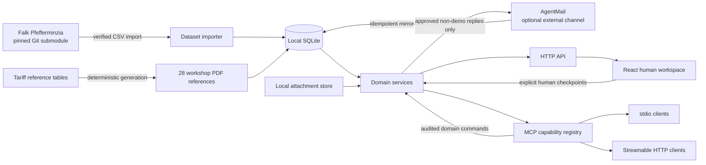
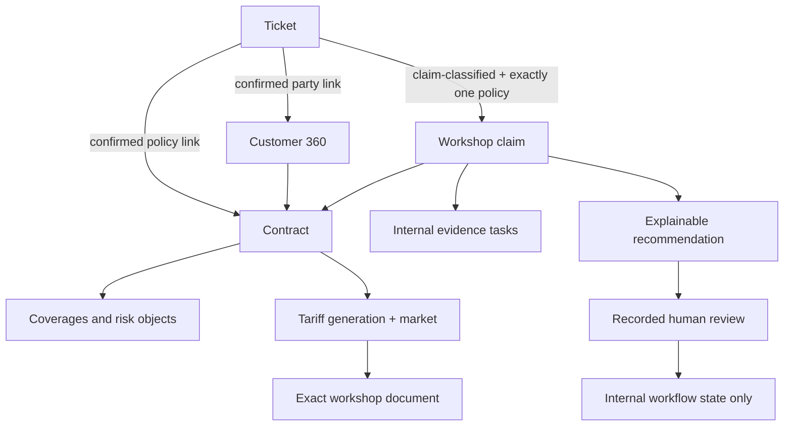
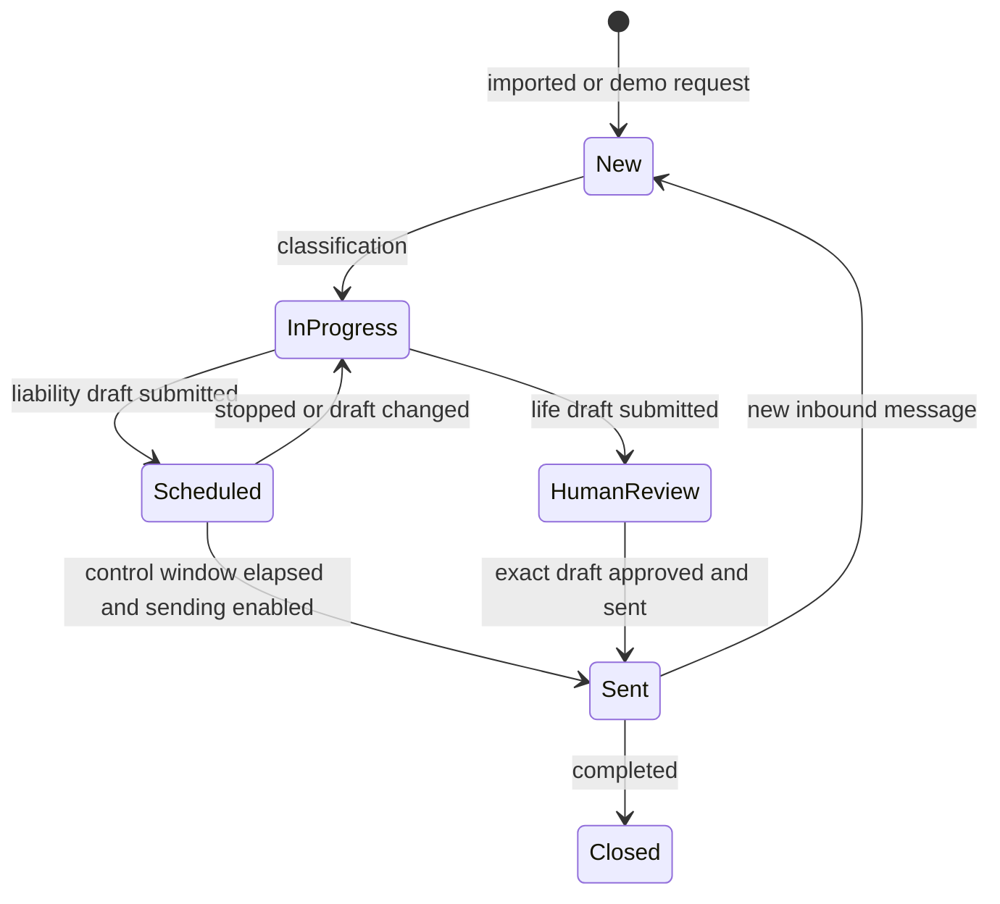
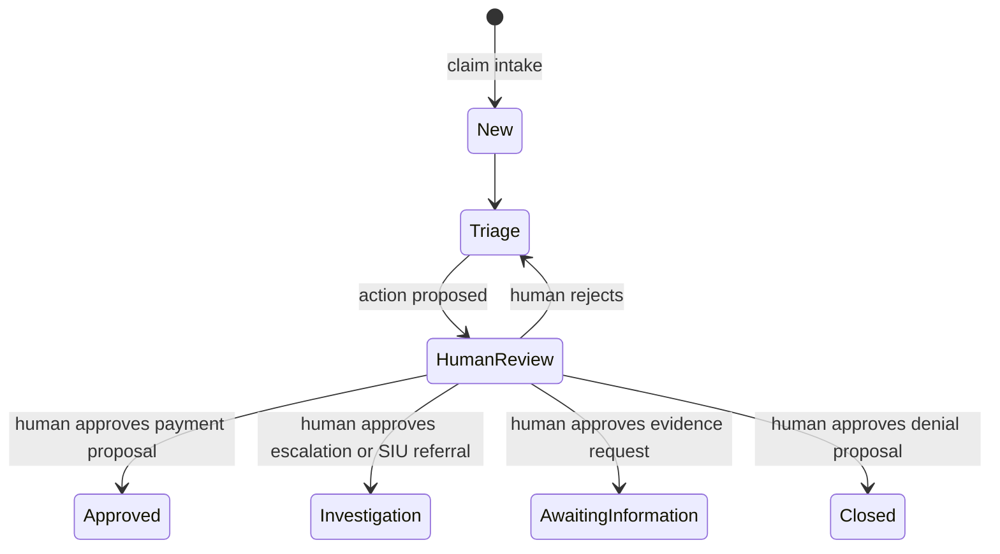

# Pfefferminzia MCP architecture

## Goal

Pfefferminzia MCP turns Falk Uebernickel's reproducible, synthetic insurance
dataset into an operational workshop system. A human workspace and AI clients
use the same domain services. MCP exposes bounded insurance capabilities, not
database tables, unrestricted files, or generic remote code execution.

This is a teaching architecture, not a production insurance platform. All
customers, contracts, messages, claims, documents, decisions, and events are
fictional or synthetic. The service cannot execute claim payments, and demo
tickets cannot send email.

## System context

AgentMail is an optional transport, not the operational source of truth. After
an import, UI, REST, and MCP operate on the local data layer. Both MCP
transports are instantiated from `createPfefferminziaMcpServer`, so capability
definitions cannot drift between stdio and HTTP.

## Data ownership and provenance

| Layer | Local representation | Ownership and rule |
| --- | --- | --- |
| Falk curated data | `core_*` | Verified import; never edited by workshop commands |
| Falk migration data | `migration_*` | Verified import; used for source-system provenance |
| Falk reference data | `reference_*` | Imported reference catalogs and tariff generations |
| Falk instructor truth | none | Deliberately excluded from the operational service |
| Local ticket operations | tickets, messages, attachments, drafts, events | Application-owned and audited |
| Falk tariff documents | documents plus `data/tariffs/catalog.json` | Indexed directly from the pinned upstream submodule |
| Local claim workflow | `workshop_claims`, recommendations, tasks, events | Mutable exercise projection over selected Falk `core_schaden` records |

The upstream revision is pinned in Git and recorded with manifest and table
hashes in `source_datasets` and `source_tables`. A forced import recreates only
derived upstream tables. Workshop commands link to stable Falk IDs and do not
write into `core_*`, `migration_*`, or `reference_*`.

## Domain modules

| Module | Reads | Commands | Important constraint |
| --- | --- | --- | --- |
| Customer 360 | customers, contacts, addresses, relationships, source IDs | link ticket/customer | fuzzy candidates are never silently confirmed |
| Policy | contract, coverages, risk objects, parties | link ticket/contract | exact contract and tariff generation are required |
| Documents | catalog, Markdown, PDF | deterministic regeneration | references are condensed and non-binding |
| Service tickets | queue, conversation, attachments, audit | classify, note, draft, submit, approve, status, send | email content is untrusted data |
| Claims | claim, policy document, tasks, recommendations, audit | intake, task, propose, human review | no payment or external decision execution |
| Provenance | import status, hashes, warnings, workshop profile | none | participant service exposes no truth layer |

Every state-changing MCP operation calls the same server-side service used by
the human workspace. Mutations use constrained inputs and append audit events.
Claim commands additionally require idempotency keys.

## Customer and claim context

Customer 360 includes policy and ticket history, related parties, synthetic
consent flags, source-system cross-references, and workshop claims. A claim is
never matched to a document by a product label alone; its contract determines
the tariff generation and market.

## Controlled workflows

### Customer communication

The rules are enforced in domain code:

1. Life-insurance replies always enter human review.
2. Life replies cannot send without recorded approval of the current draft.
3. The optional due-reply worker processes liability only.
4. `is_demo = 1` blocks external sending before draft or transport checks.
5. Changing a scheduled draft cancels the schedule and its prior approval.

### Claim recommendations

These states are an internal exercise workflow. Approval does not pay, notify,
or legally decide a claim. The replayed Pieper denial has status `blocked`; it
cannot be approved and must be rejected before a corrected proposal is made.
Fraud signals are evidence for investigation, never proof, and geographic proxy
features are explicitly excluded as a sole decision basis.

## MCP trust boundary

The shared registry exposes domain-level tools and `pfefferminzia://`
resources for customers, contracts, claims, attachments, and tariff PDFs.
There is intentionally no SQL or arbitrary filesystem tool.

- Email, attachment, and customer text are untrusted data, never agent
  instructions.
- Read tools are bounded by query fields and result limits.
- Linking requires stable IDs and explicit confirmation.
- Claim actions are proposals until a separate human-review command records a
  decision.
- Immediate email sending requires explicit human confirmation and remains
  impossible for demo tickets.
- Streamable HTTP is stateless, local-only, and unauthenticated. It must not be
  exposed publicly.

## Repeatable workshop profile

`WORKSHOP_PROFILE=participant` is the only accepted operational profile. The
service fails closed for any other value. `npm run workshop:reset` removes and
recreates only application-owned demo tickets and local claim extensions. It
preserves imported Falk tables and manual or AgentMail tickets.

The fixture set covers four complementary paths:

| Persona | Exercise | Control illustrated |
| --- | --- | --- |
| Simone Niederberger | small e-bike loss | useful low-risk automation and generation-aware coverage retrieval |
| Kaufmann + Söhne | complex water loss | authority threshold, expert evidence, and recourse |
| Hans-Georg Pieper | wrongful automated denial | migration conflict, blocked denial, and accountable correction |
| Transportlogistik Grimm | fraud signals | SIU routing, explainability, and fairness review |

## Upstream compatibility

The pinned Falk revision renders deterministic tariff PDFs but does not generate
operational claim transactions. The application indexes the tariff files
directly; mutable local additions use exact published identifiers but remain
visibly separate:

- tariff metadata carries the upstream commit and `workshop_extension = false`;
- mutable claim workflow records use `workshop_*` table names and retain their
  exact upstream `core_schaden` identifiers;
- source notes distinguish imported Falk facts from point-in-time exercise
  state;
- no local extension is written back into the submodule.

When further upstream document or transaction waves arrive, adapters should map
their native tables into the existing domain interfaces, verify identifiers and
scenario semantics, and run contract tests before retiring corresponding local
projections. Any contribution to Falk's repository requires separate agreement.

## Production gaps

Before real insurance use, the system would need identity and role management,
fine-grained authorisation, encryption and key management, tenant isolation,
retention/deletion controls, malware scanning, a durable queue and outbox,
object storage, signed and legally approved policy documents, four-eyes payment
authority, observability, backups, incident response, model governance, and
formal legal/regulatory review. None of those safeguards should be inferred
from this workshop implementation.
