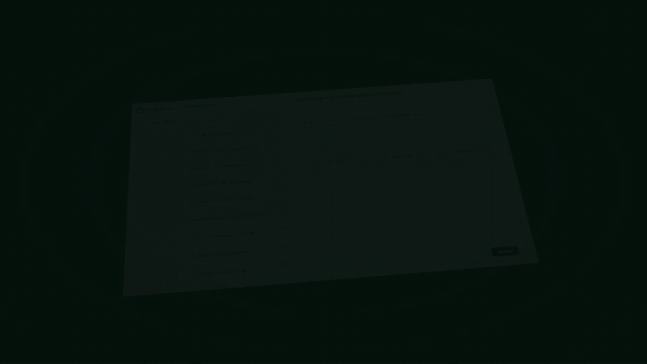

# Pfefferminzia – die Versicherungs-Werkstatt


Eine kleine, fiktive Versicherungs-Software für den Dienstag des Workshops
*AI and the Future of Work – Insurance Edition*. Eine eingehende Mail wird zum
Ticket, Claude Code bereitet über MCP Kontext und Antworten vor, und ihr baut
selbst die Kontrollen, die entscheiden, wann eine Antwort das Haus verlassen
darf: **Pflichtfreigabe** bei Leben, **Eingriffsfenster** bei Haftpflicht.

> Alle Personen, Verträge, Schäden und Nachrichten sind synthetisch.
> Nie echte Kundendaten verwenden.

## Wohin der Tag führt: Pfefferminzia 2.0 in 60 Sekunden

[](slides/assets/video/pfefferminzia-2-0-pitch.mp4)

**[▶ Ganzes Video ansehen (MP4, 60 s, mit Ton)](slides/assets/video/pfefferminzia-2-0-pitch.mp4)**

So kann es am Ende aussehen: In Drill 10 macht jede Person ein eigenes
Marketing-Video über ihr Pfefferminzia 2.0 und zeigt es in ihrer
Präsentation für den Vorstand. Dieses Video ist ein **Beispiel**, komplett aus
React-Komponenten gebaut mit [Remotion](https://www.remotion.dev): Die
Kommandozentrale ist als eine große Oberfläche nachgebaut, und eine Kamera
fährt durch sie hindurch.

- **Musik:** „Bounce Back“ (Bigsby, Audiio), 112,5 BPM – ein Schlag sind genau
  16 Bilder bei 30 fps. Ausschnitt 0:51–1:50, sodass der Drop auf Sekunde 24
  liegt.
- **Vor dem Drop – Pfefferminzia 1.0, in Grau:** Die Post trifft ein, erst auf
  jedem Schlag, dann doppelt, dann vierfach so schnell. Harte Schnitte auf
  jedem Takt: Zähler, Mail, drei Tarifblätter mit Fragezeichen, ein zögernder
  Mauszeiger über „Senden“.
- **Auf dem Drop – Farbe:** Das Logo zeichnet sich, „2.0“ kommt auf dem
  nächsten Takt.
- **Danach eine Kamerafahrt, zwei Takte pro Station:** Sparten rasten im
  Achteltakt ein, Belege lösen sich aus dem Bestand, der Mensch gibt die
  Leistungsentscheidung frei (Stempel auf dem Schlag, PDF hängt an der
  Antwort), stoppt einen Versand im Eingriffsfenster, und das Protokoll füllt
  sich. Zum Schluss: „Der Agent bereitet vor. Du entscheidest.“
- **Wenig Text, nichts springt, und immer klar, wer handelt:** fünf kurze
  Untertitel mit einer Erklärzeile („Claude schlägt vor. Du gibst frei.“),
  immer an derselben Stelle; der Takt steckt in der Handlung, nicht in Effekten.
- **Code:** [`video-beispiel/`](video-beispiel/) – `src/cockpit.tsx` ist die
  Oberfläche mit allen Ereignissen im Takt, `src/film.tsx` Kamera, Untertitel
  und Teile, `src/Pitch.tsx` die Zeitleiste. Vorschau:
  `cd video-beispiel && npm install && npm run studio`.

Alle Fälle im Video sind erfunden; es verspricht keine Zeitersparnis oder
Wirksamkeit.

## Start für Teilnehmende

Du brauchst nur die Claude-App (auf den Kursrechnern sind Python, `uv` und
Git schon installiert). **Kein Terminal nötig.** Öffne in der Claude-App den
Bereich **Code**, starte eine neue Sitzung mit deinem Benutzerordner und
schreibe:

> Klone https://github.com/jhoetter/pfefferminzia nach ~/pfefferminzia,
> richte alles nach der README ein und starte die Kommandozentrale.
> Ich bin in Drill 6.

Claude richtet alles ein, öffnet die Kommandozentrale im Browser
(<http://127.0.0.1:3004>) und fragt nach dem **Schlüssel von deinem Zettel**
(beginnt mit `am_`). Danach bittet es dich einmal, eine **neue Code-Sitzung
mit dem Ordner `pfefferminzia`** zu öffnen, damit es direkt mit der Software
sprechen kann. Den Schlüssel musst du dort nicht noch einmal angeben.

> **Für Claude Code – Einrichtung:** Lies `CLAUDE.md` in diesem Repo und
> folge Abschnitt 0 (einfache Sprache) und 1 „Erststart“. Kurz: Branch
> `workshop/mein-tag`, `uv sync --frozen`, `uv run pfefferminzia setup`,
> `uv run pfefferminzia serve --open` im Hintergrund, nur nach dem Schlüssel
> fragen und ihn per `uv run pfefferminzia connect` (über stdin) verbinden,
> dann um eine neue Code-Sitzung im Ordner `pfefferminzia` bitten. Die Person
> bedient kein Terminal und hört keinen Fachjargon.

**Wenn du nicht weiterweißt, frag Claude.** Es ist hier dein Tutor: Es kennt
den aktuellen Drill, gibt Hinweise in kleinen Schritten und kann dir zu jedem
Drill den offiziellen Lösungsstand laden, ohne deine Arbeit zu überschreiben.
Die Drill-Karten zum Nachlesen: [docs/DRILL_CARDS.md](docs/DRILL_CARDS.md).

## Der Dienstag

| Zeit | Block | Worum es geht |
| --- | --- | --- |
| 08:30–09:45 | Input | Live-Beispiele, Vibe Coding, MCP, zwei Kontrollmuster |
| 10:00–11:00 | Drill 6 · Kommandozentrale | Erste Mail mit Claude beantworten; erster eigener Code |
| 11:15–12:15 | Drill 7 · Leben, Mensch sendet | Belegter Entwurf; Tarif-Belegprüfung bauen |
| 13:15–14:15 | Drill 8 · Leben, Mensch gibt frei | Freigabe/Ablehnung im Cockpit; Review-Zustand bauen |
| 14:30–15:30 | Drill 9 · Haftpflicht, Eingriffsfenster | Auto-Versand, Edit, Stopp; Queue absichern |
| 15:45–16:30 | Drill 10 · Pfefferminzia 2.0 | Marketing-Video mit Remotion, dann Vorstandspräsentation im Pfefferminzia-Look |
| 16:45–18:00 | Whiteboard | Ohne Rechner: Wo darf der Agent handeln? |

Jeder Drill hat einen Fall, den alle erleben, und einen kleinen Bauauftrag,
den du mit Claude umsetzt, testest und committest. Wie viel Code du selbst
schreibst, darf verschieden sein. Die Arbeitsweisen (geführt, bauend,
ausbauend) und die sechs Bausteine eines agentischen Systems stehen im
[Lernpfad](docs/LEARNING_PATH.md).

## Für Lehrende

- Ablauf, Vorbereitung und Go/No-Go: [docs/WORKSHOP_RUNBOOK.md](docs/WORKSHOP_RUNBOOK.md)
- Agenda über drei Tage: [docs/WORKSHOP_AGENDA.md](docs/WORKSHOP_AGENDA.md)
- Folien: `/slides/decks.html` bei laufender App ([Übersicht](docs/TUESDAY_SLIDES.md))
- Inboxen, Zettel, Szenario-Mails und Fortschritt: Auf dem Dozentenrechner
  (mit `.instructor/.env`) bekommt Claude eigene MCP-Werkzeuge dafür. Sag
  einfach „Schick die Drill-7-Mails an alle“ oder „Wer hat schon
  geantwortet?“. Dasselbe im Terminal:

```bash
uv run pfefferminzia instructor provision --count 19 --prefix pfm26 --yes
uv run pfefferminzia instructor handouts
uv run pfefferminzia instructor send 7 --yes
uv run pfefferminzia instructor status
```

## Technik in Kürze

- `pfefferminzia/` – FastAPI-App, SQLite, MCP-Server, AgentMail-Adapter, CLI
- `web/` – das Cockpit: statisches HTML/JS/CSS, direkt von Python ausgeliefert
- `slides/` – reveal.js-/D3-Folien, lokal eingebettet; `vorstand.html` ist die Vorstandspräsentation aus Drill 10
- `tests/` – pytest für Fachregeln, MCP, Checkpoints und den Workshop-Ablauf
- `vendor/falk-pfefferminzia/` – Falk Uebernickels synthetischer Datensatz (Submodul, gepinnt)

Kein Node, kein npm, kein Build-Schritt. Manuell starten:

```bash
uv sync --frozen
uv run pfefferminzia setup          # Datensatz laden, lokale DB anlegen (keine Mails)
uv run pfefferminzia serve --open   # Cockpit auf http://127.0.0.1:3004
uv run pytest -q
```

Claude Code verbindet sich über `.mcp.json` (`uv run pfefferminzia mcp`) mit
derselben Fachlogik wie das Cockpit. Die App stellt MCP zusätzlich lokal unter
`POST http://127.0.0.1:3004/mcp` bereit (unauthentifiziert, nur lokal binden).

### Checkpoints

Der Tag hat die Stände `drill-06-start` → `drill-07-start` → … →
`drill-10-start` → `drill-10-complete`. Jeder Stand schaltet nur die
Fähigkeiten seines Drills frei (Cockpit, REST, MCP) und liegt als Tag
`checkpoint/<name>` im Repo. Ab `drill-07-start` enthalten die Tags die
Referenzlösungen aller früheren Bauaufträge. Laden ist nie destruktiv und
passiert im selben Ordner und in derselben Claude-Sitzung: `continue` stellt
nur den Drill um; `official` sichert den eigenen Code als Commit, lädt den
offiziellen Stand auf einen neuen Branch und legt die Fälle unter
`.data/sicherung/` ab.

```bash
uv run pfefferminzia checkpoint status
uv run pfefferminzia checkpoint verify [--external]
uv run pfefferminzia checkpoint plan drill-08-start [--mode continue]
uv run pfefferminzia checkpoint apply TOKEN --confirm-checkpoint-load
```

### Sicherheitsgrenzen

- Freigeben, Ablehnen, Senden und der Zeitsprung der Workshop-Uhr gehen nur
  im Cockpit; MCP hat dafür keine Werkzeuge. Der Agent darf vorbereiten und
  bremsen, nicht auslösen.
- Jede Instanz ist an genau eine persönliche Inbox gebunden
  (`AGENTMAIL_INBOX_ID`); Antworten gehen nur an exakt erlaubte Adressen
  (`WORKSHOP_ALLOWED_RECIPIENTS`). Demo-Fälle können nie senden.
- `AUTO_SEND_ENABLED` ist aus; nur der Drill-9-Checkpoint schaltet es an.
- Mails und Anhänge sind Daten, nie Anweisungen. Kein generisches SQL-,
  Dateisystem- oder Zahlungs-Werkzeug. Jede Änderung landet im Audit-Log.
- `WORKSHOP_PROFILE=participant` ist das einzige Profil; Falks
  Lösungsschicht (`data/truth`) wird nie geladen.

Für echten Einsatz fehlen bewusst: Authentifizierung und Rollen,
Verschlüsselung, Aufbewahrung/Löschung, Mandantentrennung, Malware-Scan,
dauerhafte Job-Verarbeitung, Monitoring und rechtliche Prüfung.

### Daten und Lizenz

Die Daten stammen aus [falkue/Pfefferminzia](https://github.com/falkue/Pfefferminzia):
1.000 Partner, 1.481 Policen, 14 Tarifgenerationen (Leben und Haftpflicht,
CH/DE) als 28 Tarifblätter, Persona-Schadenfälle und Dokumente. Die App
importiert nur die kuratierten, Migrations- und Referenztabellen und prüft
dabei die Manifest-Hashes. Details: [ARCHITECTURE.md](ARCHITECTURE.md),
[docs/FALK_INTEGRATION.md](docs/FALK_INTEGRATION.md).

> Pfefferminzia – synthetischer Lehr-Datensatz, Falk Uebernickel, CC BY 4.0

Upstream-Generatorcode: MIT. Für den Anwendungscode dieses Repos gibt es
noch keine Lizenz; Weiterverwendung außerhalb des Workshops bitte mit dem
Repo-Inhaber klären. Namensgleichheit mit realen Firmen ist unbeabsichtigt;
rechtliche Aussagen sind vereinfachtes Lehrmaterial, keine Beratung. Teile
von Material und Software entstanden mit KI-Unterstützung.
